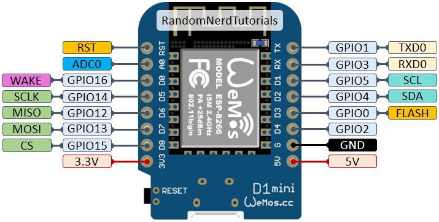

# Butterfly Engine

## Description

Automatic watering system for a garden using ESP8266. It relies on environment temperature and humidity to determine if the plant needs water. It determines based on it a factor of water needed. This is an improvement over sensors that are directly in contact with the soil, as it prevents the corrosion of the sensor.

While not perfect it is a great proxy for the soil moisture.

## Hardware

Use an ESP8266 board with a DHT22 sensor.



It also manages a pump that is used to water the plant. The pump is controlled by a MOSFET, you can see how to use a MOSFET as a switch [here](https://eltallerdelhuerto.com/mofset-switch-copy).

Water is taken from a tank that is connected to the pump. To know if the tank is empty, we use a switch sensor, directly inserted into the wall of the water tank.


For power, I've used an AGM U-POWER 12V 7.2Ah battery, connected to a solar charger and panel. So the system is completely autonomous. I only have to fill the water tank and review the irrigation drippers.

## Software

It uses the [Blynk ecosystem](https://blynk.io/). On top of it, the code is written to work without connection to the internet, in case of network failures or power outages.

## Secrets

Since this is for personal use, and for obvious reasons, this project relies on Git-Crypt to encrypt the secrets used for the WiFi connection and Blynk. Once you have the key, you can unlock the repository with:

```bash
git-crypt unlock /path/to/key
```
